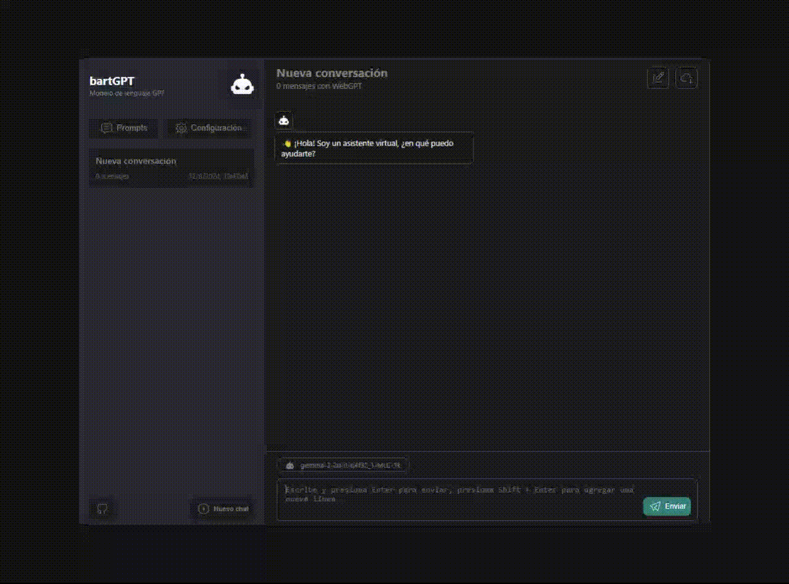

# barGPT: Tu Asistente Personal en Local

### Descripción
LocalChat es una aplicación de inteligencia artificial basada en el modelo GPT-4 que puedes ejecutar directamente en tu navegador sin necesidad de estar conectado a la red. A diferencia de otras soluciones en línea, LocalChat garantiza la privacidad y la seguridad de tus conversaciones, ya que todos los datos se procesan localmente en tu dispositivo.  
  
### Características Principales
- **Interfaz Amigable**: LocalChat tiene una interfaz sencilla y fácil de usar. Puedes escribir tus preguntas o mensajes directamente en la caja de texto y recibir respuestas instantáneas.
- **Personalización**: Puedes ajustar la personalidad y el tono de LocalChat según tus preferencias. ¿Quieres que sea más formal o más relajado? ¡Tú decides!
- **Funcionalidad Offline**: No necesitas estar conectado a Internet para usar LocalChat. Ideal para situaciones en las que no tienes acceso a la red o cuando valoras la privacidad.
- **Comandos Especiales**: LocalChat admite comandos especiales para realizar tareas adicionales. Por ejemplo, puedes pedirle que genere un resumen de un artículo o que te ayude a escribir un correo electrónico.
- **Guardado de Conversaciones**: LocalChat almacena tus conversaciones en tu dispositivo, lo que te permite revisarlas más tarde o exportarlas si lo deseas.

### Cómo Usar bartGPT  
- Abrir la Aplicación: Simplemente abre tu navegador y accede a la URL local donde tienes instalada LocalChat.
- Escribe tus Mensajes: Escribe tus preguntas, comentarios o cualquier cosa que quieras decirle a LocalChat en la caja de texto.
- Recibe Respuestas Instantáneas: LocalChat procesará tus mensajes y te proporcionará respuestas relevantes y coherentes.  

### Requisitos del Sistema
- Navegador web moderno (Chrome, Firefox, Edge, etc.)
- Al menos 8 GB de RAM
- El espacio de almacenamiento para guardar las conversaciones dependerá del navegador utilizado.  

  
### Screenshot

